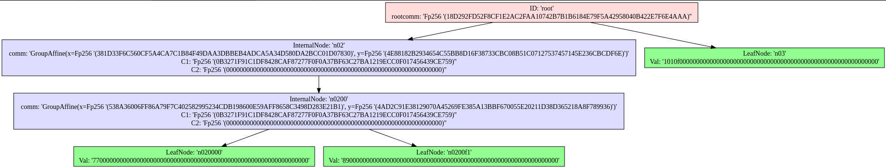

# verkle-experiments-rust

Simulation experiments on `verkle trie` in rust.

`deps/rust-verkle` is added as a git submodule (modified subcomponent) which references `https://github.com/crate-crypto/rust-verkle`

To run the simulation:
```
sh runsim.sh
```
